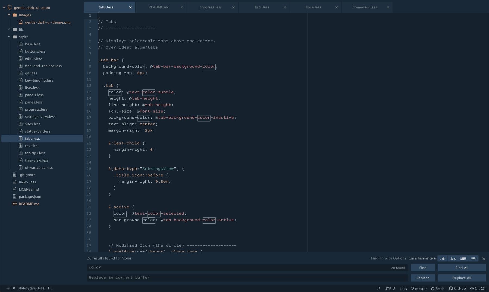

# Gentle Dark UI Theme



The Gentle Dark UI Theme is a pleasing, dark theme for the Atom IDE.  It pairs well with the [Gentle Dark Syntax Theme](https://atom.io/themes/gentle-dark-syntax).

## Installation

### Atom
- Go to **Preferences** > **Settings** > **Install**, type `gentle-dark-ui` in the input field, and select the **Themes** button.
- Click **Install** in the card for gentle-dark-ui.

### Command-line
Go to a command prompt and type the following:

```sh
apm install gentle-dark-ui
```

---

Built for fun by Gentle Lion Studios<br>
[gentlelionstudios.com](https://www.gentlelionstudios.com)<br>
[twitter.com/glionstudios](https://twitter.com/glionstudios)
